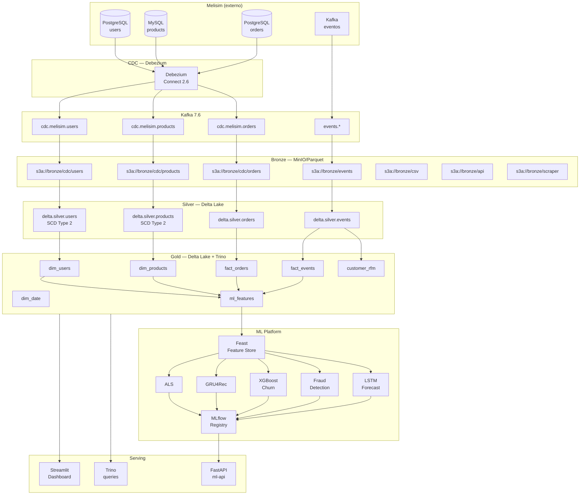

# MeliSimLake — Arquitetura

## Visão geral

```
┌──────────────────────────────────────────────────────────────────────┐
│  CONSUMO (Gold)                                                      │
│  ├─ FastAPI (ml-serving)         → /recommend, /predict, /forecast   │
│  ├─ Streamlit (dashboard)        → analytics + ML monitoring         │
│  └─ Trino + DBeaver              → queries ad-hoc                    │
├──────────────────────────────────────────────────────────────────────┤
│  ML PLATFORM                                                         │
│  ├─ MLflow (tracking + registry + serving)                           │
│  ├─ Feast (feature store, lê do Gold Delta)                          │
│  └─ Modelos:                                                         │
│     ├─ ALS             (recomendação geral)                          │
│     ├─ XGBoost Churn   (previsão de churn)                           │
│     ├─ Isolation Forest + XGBoost Fraud (detecção de fraude)         │
│     ├─ GRU4Rec         (recomendação session-based)                  │
│     ├─ SASRec          (transformer comparativo)                     │
│     └─ LSTM Forecast   (demanda por categoria)                       │
├──────────────────────────────────────────────────────────────────────┤
│  TRANSFORMAÇÃO                                                       │
│  ├─ PySpark 3.5 (Bronze → Silver) — Delta Lake ACID + SCD2           │
│  ├─ dbt-core 1.8 + dbt-trino (Silver → Gold) — Kimball dimensional   │
│  └─ Great Expectations 1.x (qualidade em todas as camadas)           │
├──────────────────────────────────────────────────────────────────────┤
│  STORAGE (Lakehouse Medallion em MinIO/S3)                           │
│  ├─ Bronze: Parquet bruto, particionado por event_date               │
│  ├─ Silver: Delta Lake limpo, deduplicado, SCD Type 2, ACID          │
│  └─ Gold:   Delta Lake dimensional (fatos + dimensões Kimball)       │
├──────────────────────────────────────────────────────────────────────┤
│  INGESTÃO                                                            │
│  ├─ CDC: Debezium 2.6 → Kafka 7.6 → Spark Structured Streaming       │
│  ├─ Streaming: tópicos Kafka do Melisim → Spark Streaming            │
│  ├─ Batch: Airflow → PySpark (CSV em S3, APIs externas)              │
│  └─ Scraping: Playwright (preços/categorias públicas)                │
├──────────────────────────────────────────────────────────────────────┤
│  ORQUESTRAÇÃO: Airflow 2.10 (DAGs por domínio + lineage DataHub)     │
│  GOVERNANÇA:   DataHub (catálogo + lineage end-to-end)               │
│  OBSERVABILIDADE: Prometheus 2.53 + Grafana 11.1                     │
└──────────────────────────────────────────────────────────────────────┘
```

## Diagrama de fluxo de dados



## Camadas de dados

### Bronze
- **Formato**: Parquet, compressão Snappy
- **Partição**: `event_date=YYYY-MM-DD`
- **Schema**: inferido na leitura, sem transformação
- **Idempotência**: overwrite por partição (não dedup)
- **Retenção**: 90 dias

### Silver
- **Formato**: Delta Lake (ACID)
- **Schema**: explícito, definido em `transformation/spark_jobs/src/lib/schemas.py`
- **Deduplicação**: MERGE INTO por chave de negócio + timestamp
- **Histórico**: SCD Type 2 para users e products (`valid_from`, `valid_to`, `is_current`)
- **Retenção**: 2 anos

### Gold
- **Formato**: Delta Lake (ACID)
- **Modelagem**: Kimball — fatos e dimensões
- **Construção**: exclusivamente via dbt
- **Surrogate keys**: `MD5(business_key)` geradas no dbt
- **Retenção**: ilimitado

## Tech stack com versões

| Componente          | Versão         |
|---------------------|----------------|
| Python              | 3.11           |
| PySpark             | 3.5.1          |
| Delta Lake          | 3.2.x          |
| dbt-core            | 1.8.x          |
| dbt-trino           | 1.8.x          |
| Great Expectations  | 1.1.x          |
| Airflow             | 2.10.0         |
| MLflow              | 2.16.0         |
| Feast               | 0.40.x         |
| FastAPI             | 0.115.x        |
| Streamlit           | 1.38.x         |
| Kafka               | 7.6.0          |
| Debezium            | 2.6            |
| Trino               | 446            |
| MinIO               | RELEASE.2024   |
| Prometheus          | 2.53.0         |
| Grafana             | 11.1.0         |
| XGBoost             | 2.1.x          |
| PyTorch             | 2.3+           |
| Optuna              | 4.x            |

## Decisões de design

### Por que Delta Lake em vez de Iceberg?
Delta Lake tem integração nativa com PySpark e suporte a MERGE INTO robusto para SCD2. Iceberg seria equivalente, mas Delta é o padrão da Databricks e amplamente usado em Mercado Livre.

### Por que dbt para Gold em vez de Spark?
dbt oferece lineage automático, testes declarativos e documentação que são essenciais para portfólio. Spark para Gold introduziria complexidade sem benefício de escala neste contexto.

### Por que GRU4Rec em vez de BERT4Rec?
GRU4Rec tem latência de inferência 3x menor e performance comparável em datasets de tamanho médio. BERT4Rec é adicionado como SASRec (transformer comparativo) para demonstrar o tradeoff.

### Por que Feast para feature store?
Feast é open-source, integra com Delta Lake/Parquet e tem suporte a online store via PostgreSQL — adequado para demonstração de feature serving em tempo real.
